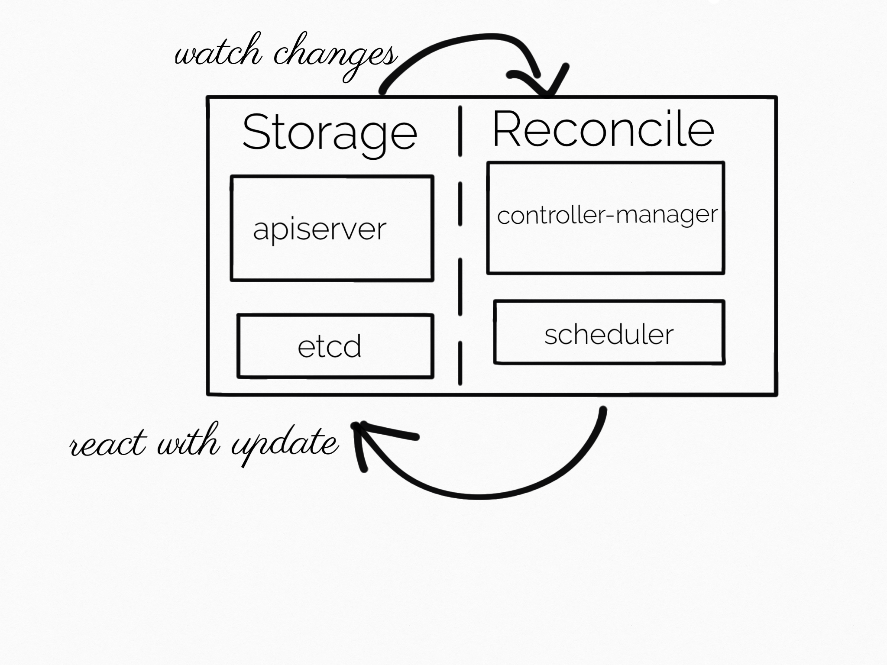
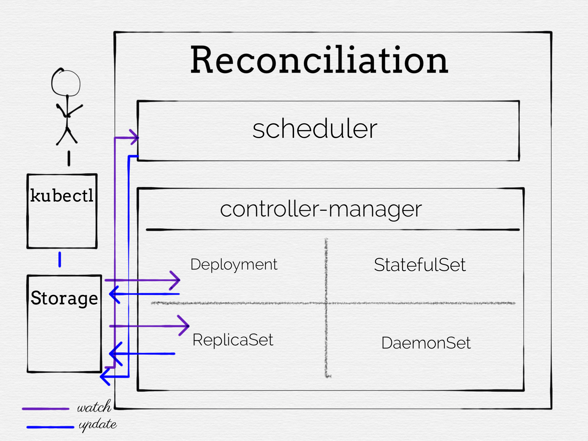
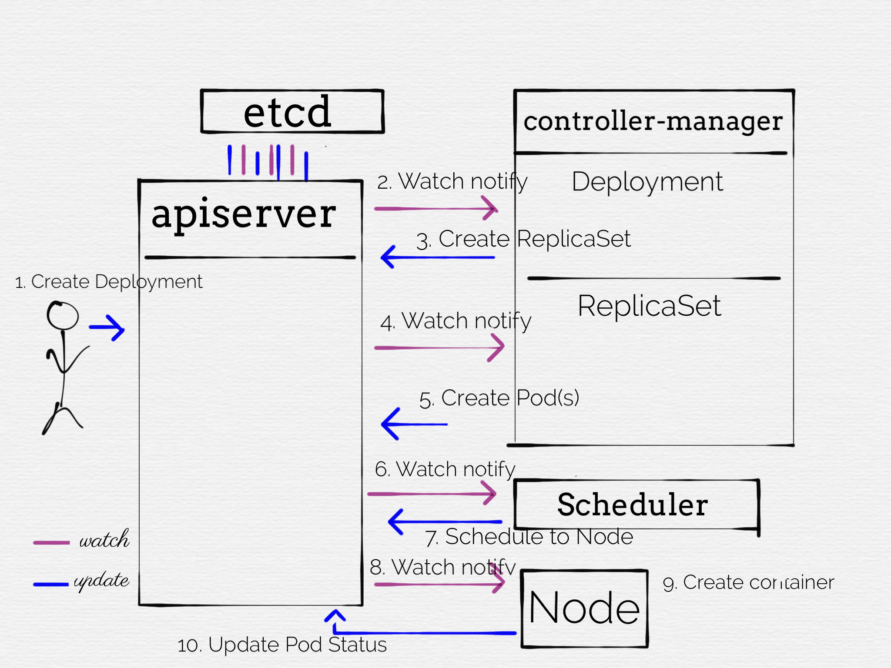

# Building and using Kubernetes APIs

This document describes how Kubernetes APIs are structured and to use the apiserver-builder project
to build them.

## Vendoring the K8s libraries for building a new API server extension

First create a new go package and use `apieserver-boot init repo --domain <your domain>`.  This
will vendor the required go libraries from kubernetes and set the initial directory and package
structure including the *apiserver* and *controller* binaries responsible for storing and
reconciling objects.

## API Structure

Following is a short summary of how APIs are structured.  This may be familiar to anyone that has worked with the
Kubernetes APIs before.

### Phases

The API can be conceptualized in 2 phases: **Storage** and **Reconciliation**.

**Storage**

Kubernetes APIs expose operations for storing resource objects declaring a desired cluster state.
e.g. *Run 10 instances of a container image with a specific configuration*.  The Kubernetes API
will return a success if the object declaration is statically validated and written to storage.

**Reconciliation**

A collection of processes commonly referred to as *controllers* watch for writes to resource
objects.

When an object is created or updated, controllers will compared the desired state
declared in the object against the observed state of the cluster, and take action accordingly.
This can be done by either updating downstream Kubernetes objects (Deployment -> ReplicaSet -> Pod) or
updating cloud provider resources (Loadbalancer).



### Properties

*Declarative*

Kubernetes APIs are designed such that the desired state of an object is
sent to the API, and the cluster works to reconcile the actual state with the desired state.
For example to rollout a new container image to a Deployment, only the declared Deployment image is updated
and the cluster will automatically perform a rollout of the new image.

*Level based*

The APIs have a level based implementation, so they will work to the current desired state, ignoring
previous desired states that may have been set.  For example, updating a Deployment image in the middle
of an existing rollout will drive directly to the new desired state instead of completing the previous
rollout.  (e.g. it won't complete rollingout of the previous image, and will switch to rolling out the new image).

*Asynchronous*

The APIs reconcile the declared desired state asynchronously, meaning the request to create a Deployment will
return before the system has tried to start any Pods.  This means many errors will not be returned to the
client as part of the initial request - e.g. if the container image is invalid the user won't find out unless they
poll or watch the Pods.  For this reason, it is important to write Status messages back to the resource as
part of reconciling the object.

Summary:

- **Declarative:** Users specify desired state, not specific operations.
- **Level based:** System drives towards current desired state and ignores previous desired states.
- **Asynchronous:** Requests will return success before the system tries to reconcile the desired state

## Storage

Storage for new resource types is defined in the file `<kind>_types.go` under `pkg/apis/<api-group>/<api-version>/`.
 
The recommended way to bootstrap a new resource type is using `apiserver-boot create group version resource`
as this will make sure the definition is well formatted and will also create supplementary files for
testing, documentation and reconciliation.

**Note**: All types created through apiserver-boot are automatically registered with the apiserver by
the code generaion.

### Resource name structure

Resources have 3 components:

*Group*: Similar a `go` package.  Provides a canonical name for the resource.  Of the form <some-name>.<some-domain>.

*Version*: Defines API stability and allows for evolving APIs in non-backwards compatible ways without breaking
backwards compatibility by incrementing the version.  Resources with the same group & kind, but different versions
generally share the same storage (listing from one version will list objects from all versions)

*Kind*: Name of the API.  e.g. Deployment, Pod, Service, etc


### Resource definition structure

Resource definitions have 3 subsections.  Creating a resource with `apiserver-boot` will automatically populate
the scaffolding for you resource definition with each of these fields.

*Metadata*: Contains metadata about the resource
- Name (unique key)
- Annotations (non-queryable key-value pairs)
- Labels (queryable key-value pairs)

*Spec*: Contains the desired state
Add fields specifying the desired state here.  Used by reconciliation loops to update the cluster.

*Status*: Contains the observed state
Add fields specifying the observed state here.  Used by clients and reconciliation loops
to understand the state of the cluster.

**Note**: Resources may have different versions with different representation.  Resources
are converted between versions during storage using an "unversioned" object.

### Storage operations

During storage operations there are several opportunities to either reject the request or
modify the stored object before it is written.


#### Create

**Note**: The following operations are synchronous, however reconciling the
stored object's desired state will happen asynchronously.

*PrepareForCreate*: Perform modifications to the underlying object before it is stored.

If unspecified
in your type, a default PrepareForCreate  implementation will be provided by apiserver-builder.
The default will drop updates to Status that do not go through the Status subresource.  The
default maybe overridden by providing a function attached to `<ResourceType>Strategy` in the
`_types.go`

**Note:** This works on the *unversioned* representation of the object.

Example:

```go
func (s <ResourceType>Strategy) PrepareForCreate(ctx request.Context, obj runtime.Object) {
    // Invoke the parent implementation
    s.DefaultStorageStrategy.PrepareForCreate(ctx, obj)

    // Cast the element
    o := obj.(*<group>.<ResourceType>)

    // Your PrepareForCreate logic here
}

```

*Validate*: Perform static validation of the values set in the resource.  Reject
the creation request if the object is not valid.

If unspecified in your type, a default Validate
implementation will be provided by apiserver-builder.  The default implementation will do no
validation.  The default maybe overridden by providing a function attached to `<ResourceType>Strategy`
in the `_types.go`:

**Note:** This works on the *unversioned* representation of the object.

Example:

```go
func (<ResourceType>Strategy) Validate(ctx request.Context, obj runtime.Object) field.ErrorList {
    o := obj.(*<group>.<ResourceType>Strategy)
    errors := field.ErrorList{}

    if <some-condition>
        errors = append(errors, field.Invalid(
            field.NewPath("spec", "<some field>"), o.Spec.<SomeField>, fmt.Sprintf("Bad value %s", o.Spec.<SomeField>)))
    }
    return errors
}
```


*DefaultingFunction*: Optional fields that need to be interpreted with some value
when they are unset should be defaulted and written to the object.  Persisting
the defaulted values makes it easier to change the default values for different
versions of the same API.

If unspecified in your type, a default DefaultingFunction will be provided by
apiserver-builder.  The default implementation will do no defaulting.

**Note:** This works on the *versioned* representation of the object.

Example:

```go
func (<ResourceType>SchemeFns) DefaultingFunction(o interface{}) {
    obj := o.(*<ResourceType>)

    // Defaulting logic here
}
```

#### Update

**Note**: The following operations are synchronous, however reconciling the
stored object's desired state will happen asynchronously.

*ValidateUpdate*: A separate validate may be specified for updates that can validate
new values against old values.  This is useful for enforcing immutability of
certain fields.

If unspecified in your type, a default ValidateUpdate will be provided
by the apiserver-builder.  Can be overriden by specifying the function
`<ResourceType>Strategy.PrepareForUpdate`.

*PrepareForUpdate*: Similar to PrepareForCreate, but for update operations.

If unspecified in your type, a default PrepareForUpdate will be provided
by the apiserver-builder.  Can be overriden by specifying the function
`<ResourceType>Strategy.PrepareForUpdate`.


#### Delete

**Note**: The delete is asynchronous and the garbage collection will be
executed after the request returns.

*Finalizers*: If a finalizer is specified on an object (e.g. PrepareForCreate)
deleting an object will set the `DeletionTimestamp` field on the object with
a grace period.  This allows controllers to see the object has been deleted
and perform cleanup of resources the object may have created.

*OwnerReference*: Automatic garbage collection may be specified by setting
an OwnerReference on the object to be garbage collected.  When the owning object
is deleted, objects with the OwnerReference will automatically be deleted.
Note: This is the preferred method for garbage collection, but will not
work for cleaning up external (non-kubernetes-object) resources.  e.g.
resources provisioned through the cloud provider.  See [garbage-collection](https://kubernetes.io/docs/concepts/workloads/controllers/garbage-collection/)
for more information.

**Summary**:

- Objects have Metadata, Spec and Status fields
- Storage operations may be rejected or transformed by the API server before the object is written.
- `apiserver-boot create group version resource` will setup the basic scaffolding for a new resource type using sane overridable defaults.


## Reconciliation



Reconciliation is performed by watching for updates to resource objects, and then writing back new objects or
updates to the apiserver.  Typically, each resource has its own controller function defined in the controller-manager
process.  However some controllers, such as the scheduler, run in their own separate process

In an apiserver-builder project, the reconciliation function for new resource types is defined in the
file `controller.go` under `pkg/controller/<kind>.go`.
 
Creating resources with `apiserver-boot create group version resource` will also create the reconciliation
function and corresponding tests for the resource.

### Controller initialization

The reconciliation implementation is automatically registered with the controller-manager binary
by the code generator and is initialized by its' Init function.
The Init function is automatically invoked as part of registering
the implementation.  Custom logic and dependencies can be defined here.

```go
func (c *<Kind>ControllerImpl) Init(
	config *rest.Config,
	si *sharedinformers.SharedInformers,
	queue workqueue.RateLimitingInterface) {
}
```

### Reconciliation loops

Updates to a resource are reconciled when a new update is observed through a watch.
Reconciliation logic is defined by implementing the following method, which accepts the
new object value as its only parameter.

**Note**: The last object value is not provided as a parameter.  This is because the system
is level based and not edge based, so no decisions should be made off the last value.

```go
func (c *<Kind>ControllerImpl) Reconcile(u *<version>.<Kind>) error {
	return nil
}
```

Reconcile logic may include:
- updating the object metadata, spec or status
- creating, updating or deleting other objects in the Kubernetes cluster (e.g. Kubernetes APIs such as Pod)
- creating, updating or deleting resources outside the Kubernetes cluster (e.g. cloud provider resources such as CloudSQL).

**Note:** there is no *deletion* hook defined.  To define deletion logic, a [Finalizer](#Delete) must be set
on the Object during creation.  This will cause a DeletionTimestamp to be set on the object when it is deleted,
resulting in the Reconcile method being invoked.

### End to end Deployment example

The following is a diagram of the storage - reconciliation interactions for creating a new Deployment.



## Advanced topics

Following are advanced topics for further customizing APIs

### Defining reconciliation constraints

As part of the Spec, it may be useful to provide constraints on how a controller may reconcile the object.
For instance, when rolling out a new Deployment the controller needs to know how many Pods may be unhealthy
at a time (specified in the Spec.RolloutStrategy).  This allows clients to still control how changes are
made to the cluster while still being declarative.

### Cross-cutting initialization hooks

It is possible to specify dynamic cross-cutting hooks for initializing and validating
objects.  This allows supporting dynamic "BeforeCreate" and "Validate" semantics
for objects by installing extensions into the cluster.  For more information see
[Dynamic Admission Control](https://kubernetes.io/docs/admin/extensible-admission-controllers/)


### Storage subresources

A resource's Status and Spec have separate endpoints for their operations:

- By default performing a storage operation to the resource will only update the Spec and Metadata.
- By default performing a storage operation to the status subresource will only update the Status and Metadata.

Additional subresources may be specified for polymorphic operations such as `scale`, which can be generally
understood by clients without having to understand the underlying structure of the object.
